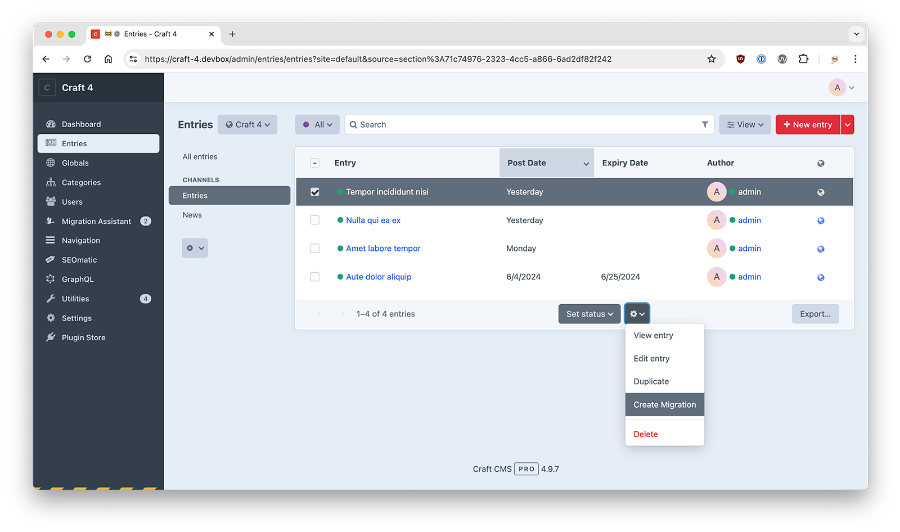
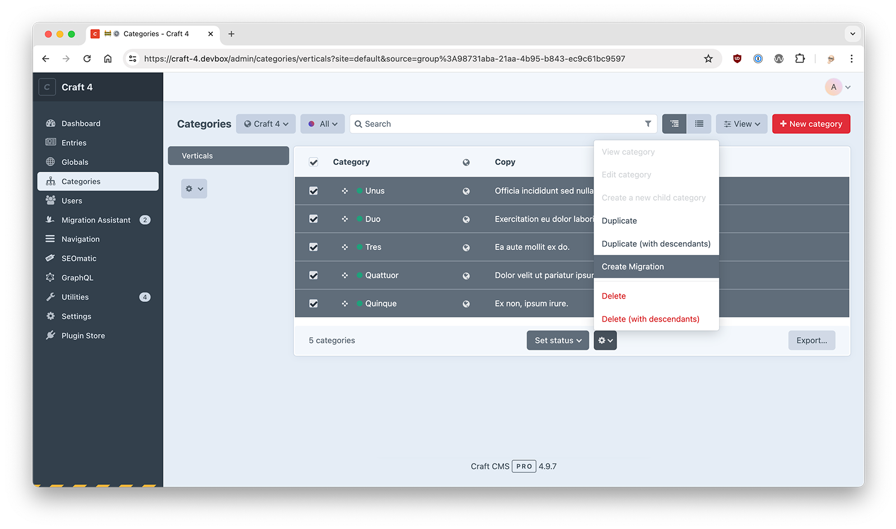
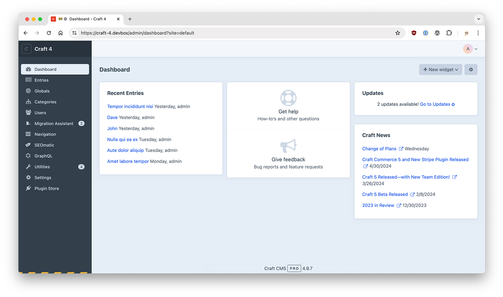
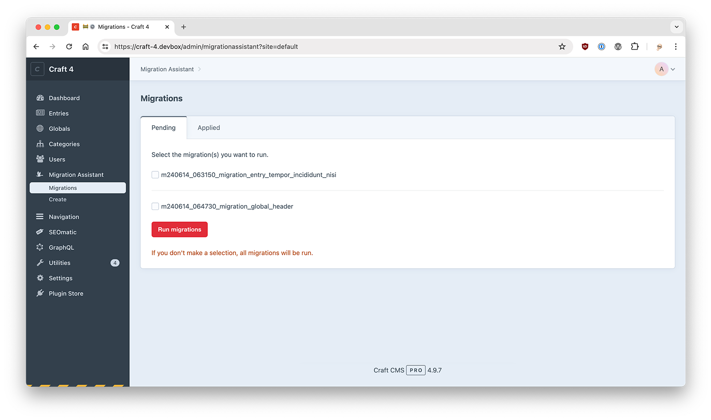

# Migration Assistant for [Craft CMS 4](https://craftcms.com/)


Create content migrations to easily move content between CraftCMS website installations. You can select which elements (entries, categories, users, globals) to migrate and create a native Craft content migration file that can be committed to your version control system. The migration(s) can then be applied on different CraftCMS installations to instantly create and update content, without needing to enter data multiple times. By using migrations you can ensure your various website environments (local, staging, production, etc.) stay in sync and up to date.


## Installation

### Plugin Store (the easy way)

- In the Craft Control Panel, go to Settings -> Plugins
- Search for 'Migration Assistant'
- click the "Install" button

### Composer Command Line (the manual way)

- Go to the command line and `cd` to your project's root folder
- Download the plugin via composer `composer require dgrigg/craft-migration-assistant`
- In the Craft Control Panel, go to Settings -> Plugins
- Click the "Install" button for Migration Assistant

## Overview

The Migration Assistant can create content migrations for the following elements:
  - entries
  - categories
  - globals
  - users

To create a migration select the element(s) you wish to migrate and then click the gear and 'Create Migration' button at the bottom of the page.




Content migrations are dependent on a workflow where you migrate related/dependent elements first. For example, if you have an entry that has some selected categories, the categories need exist on the destination site before the entry migration will work correctly. This means creating a migration of the category(ies) first. This holds true for users, assets other other entries. In the case of assets you will need to ensure the matching asset (based on asset source/folder/filename) exists on the destination site. For Global values, use the 'Create Migration' button on the global screen.

A migration file will be created in the `craft/migrations` folder. The migration filename will contain the slugs/handles of the migrated elements. Move the new migration file to your destination environment, ideally with version control.

- In your development environment:

```terminal
git add .
git commit -am 'new migration'
git push
```

- In your destination environment:

```terminal
git pull
```

When new migration(s) are in your destination environment a badge will appear to let you know. Click on the 'Migrations' tab and run the new migrations. You can run all the pending migrations by simply clicking the Run Migrations button or you can select individual migrations to run. You can also run migrations from the native Craft/Utilities/Migrations tab (this only allows you to run all pending migrations, not individual ones).



Migration Assistant uses Craft's built in migrator to run migrations. Failed migrations will be rolled back and the database will be returned to it's pre migration state. You can check both the Craft logs to see details on why the migration failed. In many instances it's simply a case of a migration having dependencies (ie required fields) that have not been setup on the destination site or a missing plugin.

You can also view previously applied migrations by clicking the 'Applied' tab on the migrationassistant/Migrations page. This will show you migrations that have already been applied and migrations that were created locally (and don't need to be run locally). Note that if you create [blank migrations](#custom-migrations) (by clicking the Create Migration button without selecting elements) they will show up in the New Migrations list, so that you have a chance to test and run them locally with your custom migration code.

## Field type support

Migration Assistant currently supports all core CraftCMS fields types:
- Assets
- Categories
- Checkboxes
- Color
- Date/Time
- Dropdown
- Entries
- Lightswitch
- Matrix
- Multi-select
- Number
- Plain Text
- Radio Buttons
- Rich Text
- Table
- Tags
- Url
- Users

In addition it also supports:

- [SuperTable](https://github.com/engram-design/SuperTable)
- [Neo](https://github.com/spicywebau/craft-neo)
- [LinkField](https://github.com/sebastian-lenz/craft-linkfield)

### Additional Field Support

To support additional field types and special content you can use event handlers for customized import/export functions. There are two distinct types of export/import procedures you need to consider when adding custom support. Exporting/importing element settings and exporting/importing element content.

To handle export/import of custom field types your plugin/module should listen for the Export/Import events that are triggered from elements that utilize fields. Following is the list of element types that the Migration Assistant has events for that allow you to modify the export/import data to support custom fields.
- Entries
- Categories
- Globals
- Users

### Using events

During the export event you can modify the \$event->value data to include any additional settings not already in the data to be exported.

```php
//Custom field example
Event::on(Fields::class, Fields::EVENT_BEFORE_EXPORT_ELEMENT, function(ExportEvent $event) {
    $value = $event->value;
    $value['typesettings']['special_setting'] = 'some special setting value';
    $event->value = $value;
});
```

During the import you can modify the data before it is imported or deal with the element after it has been imported and either created or updated.

Before import, the $event->element is the element model (based on handle match) to be imported (updated or created). The $event->value property is the raw data used to populate the element model. Change properties in the \$event->element to modify the element before it is saved.

```php
//Custom fields
Event::on(Fields::class, Fields::EVENT_BEFORE_IMPORT_ELEMENT, function(ExportEvent $event) {
   $element = $event->element;
   $element->special_setting = $event->value['settings']['special_setting'];
   $event->element = $element;
});
```

After import you can access the $event->element and $event->value to perform additional operations related to the element if needed.

```php
Event::on(Fields::class, Fields::EVENT_AFTER_IMPORT_ELEMENT, function(ExportEvent $event) {
   $event->value['typesettings']['special_setting'] = 'some special setting value';
});
```

You can also cancel an import if needed and provide an error message. Error messages will be written to the Craft web log.

```php
//Custom fields
Event::on(Fields::class, Fields::EVENT_BEFORE_IMPORT_ELEMENT, function(ExportEvent $event) {
    $event->isValid = false;
    $event->error = 'my reason for cancelling';
});
```

Any values in the field data that contains id's should be converted to handles/slugs or some string based value that can be looked up on the destination site without depending on matching id values as id values can differ between website database instances.

For importing custom fields the imported value should match the fields required input structure. Check the field type's documentation and code for help on determining the correct structure.

## Pending Migration
You can run the migrations in a variety of ways. The two standard Craft ways are either via the cli ```./craft migrate/all``` or via the Craft CP Utilities Migrations tab. Both of these methods run all available content migrations. There may be instances where you only want to run a single content migration. To do this use the 'Migration Assistant\Migrations' panel in the CP. You have the option to run one, multiple or all available migrations. You can also re-run previously applied migrations if the need arises. 



## Permissions

By default all users with admin rights have full access to the Migration Assistant and the ability to create content migrations. Non admin users can be granted permissions to access the Migration Assistant and to create content migrations in the user/permissions section of Craft.

## Custom migrations

In addition to generated migrations you can use the MigrationManger to create empty migrations that can be used for tasks like deleting fields and creating content. To create an empty migration simply click the 'Create Migration' on the Migration Assistant/Create Migrations tab. A new empty migration will be added to the `craft/migrations` folder.

View the [examples](EXAMPLES.md).

To learn more about creating custom migrations:

- [Craft CMS Official - Content Migrations](https://docs.craftcms.com/v3/content-migrations.html#creating-migrations)
- [Craft CMS 3 Content Migration Examples](https://medium.com/mikethehud/craft-cms-3-content-migration-examples-3a377f6420c3)

## Upgrading from Migration Assistant 3 

Migration Assistant 4 no longer includes migration support for fields, sections, settings, etc. Craft's core project config setup is a better mechanism for syncing Craft structure/settings across environments. 

#### Credits

The entire dev team at [Firstborn](https://www.firstborn.com/)

Flying Duck icon by Agne Alesiute from the [Noun Project](https://thenounproject.com/)
